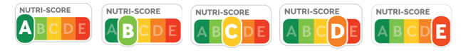

# **La vie sociale des données**

## **Questions** :
### **1) Qui a créé ce jeu de données ? À quelles fins ?**
L’algorithme a été initié par une équipe universitaire d’Oxford et repris par l’épidémiologiste et nutritionniste français **Serge Hercberg** ainsi que son équipe de l’Agence nationale de sécurité sanitaire et du Haut Conseil de la Santé Publique afin d’estimer la valeur nutritionnelle d’un aliment.

### **2) Quelles catégories sont utilisées pour le représenter ?** 
Quatre catégories sont mises en place avec des algorithmes différents :
- boissons 
- fromages 
- matières grasses 
- autres aliments

Les aliments sont ensuite indexés en cinq catégories, allant de la catégorie A, figurée en vert, à la catégorie E, figurée en rouge. Cette catégorisation suit un principe graduel où la qualité nutritionnelle se dégrade du vert au rouge. ​​

Son calcul consiste à faire la différence, **pour 100 gr ou 100 mL de produit** , entre les composantes négatives (sucres, sel, acides gras saturés) et positives (fibres, protéines, fruits, légumes, légumineuses, fruits à coques, huile de colza, de noix et d’olive) d'un aliment afin de lui attribuer une note. Celle-ci est alors transcrite sur une échelle de cinq couleurs (du vert foncé à l’orange foncé), **associées à des lettres** allant de A (« meilleure qualité nutritionnelle ») à E (« moins bonne qualité nutritionnelle »)

### **3) Quels sont les usages de ce jeu de données ?**
Le nutri-score fournit au consommateur, sur la face visible des emballages alimentaires, une information lisible et facilement compréhensible sur la qualité nutritionnelle globale des produits, au moment où il fait ses courses. Ce dernier peut ainsi comparer les produits et orienter ses choix vers des aliments de meilleure qualité nutritionnelle.. Lancé en France en 2017, plusieurs pays ont depuis décidé de recommander son utilisation. Dans une poursuite de plus grande efficacité, les autorités compétentes de Belgique, France, Allemagne, Luxembourg, Pays-Bas, Espagne et Suisse ont mis en place un mécanisme de coordination transnational pour **faciliter l'utilisation de l'étiquetage nutritionnel Nutri-Score** sur la face avant des emballages.

### **4) Quelles sont les limites ou les critiques rencontrées par ce jeu données ?**
- Jeu de données axé sur les aspects quantitatifs plutôt que qualitatifs des produits. 
- Le degré de transformation des produits n’est pas considéré, ni la présence éventuelle d’additifs, d’allergènes, d’arômes et d’édulcorants artificiels. + degré présence pesticides
- Le calcul par portion de 100g n’est pas adapté à tous les produits : là où pour certains aliments il s’agit de la quantité recommandée par jour (ex : pâtes), pour d’autres cela n’est pas du tout le cas (ex : huile) -> non prise en compte de l’équilibre alimentaire
- Les producteurs ne sont pas dans l’obligation de soumettre leurs produits au nutri-score. 

### **5) Quelles réalités ces données et indicateurs sont-ils censés représenter ?**
Ces données/indicateurs sont censés représenter la valeur nutritionnelle réelle des produits alimentaires que nous consommons, transformés notamment.
### **Consignes :**
- Interviewer (ou enquêter) sur les gestionnaires de la base de données
- Explorer les données, la forme de la base de données, son ontologie sous-jacente
- Interviewer des chercheurs, journalistes activistes utilisant ou critiquant cette base de données
- Rencontrer des usagers de la base de données (éventuellement et selon la base de données) 
- Imaginer des représentations des données

